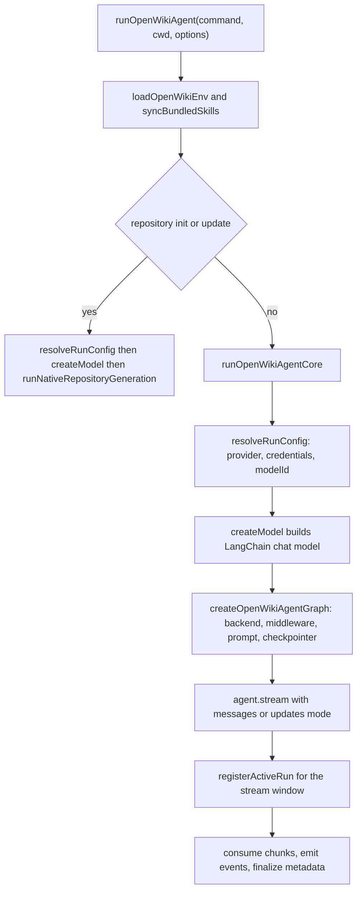

# Agent Runtime, Models, and Middleware

OpenWiki drives documentation generation through a [DeepAgents](https://github.com/langchain-ai/deepagents) agent graph built on LangChain chat models. The runtime is responsible for turning a user command into a configured agent: it resolves which provider and model to use, instantiates the correct LangChain client for that provider, wraps the filesystem in a sandboxed docs-only backend, and mounts the middleware that keeps the wiki OKF-conformant and (on updates) in the right language. A separate crash guard records and stamps runs that die outside every normal `catch`.

`runOpenWikiAgent` is the top-level entrypoint for a run. It loads persisted environment, resolves the run configuration, builds the model and agent, opens the graph stream, and consumes it while a run record is registered with the crash guard.

For provider setup and credentials see [Model Providers](/openwiki/concepts/model-providers.md) and [Configuration](/openwiki/operations/configuration.md); for the repository init/update flow that bypasses the shared agent graph see [Repository Generation](/openwiki/workflows/repository-generation.md).

## Two execution paths

`runOpenWikiAgent` splits on output mode and command. Repository `init`/`update` runs are recognized as "repository generation" and delegated to `runNativeRepositoryGeneration` (the OpenWiki page-job runner), which builds the model directly and never constructs the shared DeepAgent graph. Everything else — chat in any mode, and personal/local-wiki commands — runs through `runOpenWikiAgentCore`, which builds and streams the DeepAgent graph described on this page.

The shared graph factory `createOpenWikiAgentGraph` refuses to build for repository `init`/`update`, and the prompt builders throw for that combination too, so those commands are structurally forced down the native page-job path rather than the agent-graph path.

Control flow from the entrypoint to either the native page-job runner or the shared DeepAgent graph stream.

## Resolving the run configuration

`resolveRunConfig` performs all pre-build resolution and tags any throw with the `config` stage for failure telemetry. It resolves the provider first and reports it immediately through `onProviderResolved`, so a failure later in resolution is still attributed to the right provider.

Provider selection is `resolveConfiguredProvider`: an explicit `OPENWIKI_PROVIDER` wins, otherwise the provider is inferred from whichever provider API-key (or Bedrock AWS credential) environment variable is present, in a fixed precedence order, falling back to a default provider. After the provider is known, resolution loads any external-CLI credential, validates and ensures the provider's credentials, base URL, secret key, and region, and — for `openai-chatgpt` — refreshes the ChatGPT OAuth tokens before the model is built so `createModel` can stay synchronous.

The model id comes from `resolveModelId`: it prefers an explicit option or `OPENWIKI_MODEL_ID`, else the provider's default; a provider with no built-in model options requires the id to be set. The id is normalized and validated, and if it is a known model of a different provider a non-fatal mismatch warning is emitted (the run still proceeds, since a custom gateway may serve it). Resolution also queries `getSelectedModelAvailability`, which aborts the run when a model is provably `unavailable`, but treats an `unknown` result as fine — a catalogue lookup failure is not proof a model cannot be invoked, and only the direct `openai` provider (with an API key and no custom base URL) is actually checked.

## The provider matrix and model instantiation

`createModel` maps the resolved provider and model id onto a concrete LangChain chat model. The provider enum spans direct API-key providers (`anthropic`, `openai`, `gemini`, plus OpenAI-compatible gateways `baseten`/`fireworks`/`nebius`/`nvidia`/`openai-compatible`), OAuth (`openai-chatgpt`, `copilot`), AWS-SDK (`bedrock`), a routing gateway (`openrouter`), and Google Vertex (`gemini-enterprise`).

Each branch constructs a purpose-built client:

- **Anthropic** builds `ChatAnthropic`, applying a modern-Claude default output-token limit (raised above LangChain's 4,096 fallback only for known Claude 4/5 families) unless an explicit provider-neutral limit is set.
- **Gemini (AI Studio)** builds `ChatGoogle` with `platformType: "gai"`, disabling streaming and pinning `outputVersion: "v0"` so Gemini 3.x thought-signatures round-trip correctly across tool-calling turns.
- **Gemini Enterprise (Vertex)** delegates to `createGeminiEnterpriseModel`, which picks the client from the model family: Claude via the Anthropic Vertex SDK, partner/open-weight models over Vertex's OpenAI-compatible MaaS surface, and Gemini/Gemma over native `generateContent`. Auth is uniform ADC + project + region; only the transport differs.
- **ChatGPT OAuth** reuses `ChatOpenAI` against the Codex Responses backend with `useResponsesApi`, `zdrEnabled` (forcing `store: false`), forced streaming, and the account/originator/beta headers the Codex backend requires.
- **OpenRouter** builds `ChatOpenRouter` against the OpenRouter base URL, optionally pinning an upstream provider allowlist.
- **Bedrock** builds `ChatBedrockConverse` with the resolved AWS region and an optional stream idle-timeout watchdog.
- **OpenAI and all OpenAI-compatible gateways** fall through to a shared `ChatOpenAI` branch that honors a per-provider base URL, chooses the Responses API when the provider config asks for it, and forces streaming for gateways that only serve the streaming transport.

`createModel` also threads a resolved reasoning config: `OPENWIKI_REASONING_EFFORT` is applied only to models that declare a reasoning capability, and it is sent either as a Responses-API `reasoning.effort` payload or as a chat-completions `reasoning_effort` kwarg depending on the model's declared transport; an unsupported provider/model or an invalid effort value throws.

### Vertex surface routing

For `gemini-enterprise`, the API surface is a function of the model id, not the provider: `resolveVertexSurface` classifies an id as `anthropic`, `openai-maas`, or (default) `gemini`. The Claude-on-Vertex bridge neutralizes any ambient `ANTHROPIC_API_KEY`/`ANTHROPIC_AUTH_TOKEN` around the synchronous `AnthropicVertex` constructor so a stray native Anthropic key cannot clobber the Google OAuth token, and the MaaS surface injects a fresh ADC bearer token per request via a `fetch` wrapper so long sessions survive token expiry while `createModel` stays synchronous.

## Building the agent graph

`createOpenWikiAgentGraph` constructs the DeepAgent from the initialized model. It creates an `OpenWikiLocalShellBackend` rooted at the run cwd (with `docsOnly` enabled for every command except chat), wraps it in a composite backend that adds fixed virtual mounts, and passes the middleware pipeline, connector tools, filesystem permissions, and command-specific system prompt to `createDeepAgent`.

The composite backend (`createAgentBackend`) mounts two additional read-only virtual filesystems alongside the wiki backend: `/conversation_history/` for DeepAgents' history offload and `/skills/` for the bundled skills. A shared filesystem permission set additionally denies writes under both `/skills/**` and the conversation-history mount, and the composite backend converts a known upstream broad-glob recursion overflow into a bounded, model-facing "narrow your search" error instead of crashing the run.

The agent is streamed with `subgraphs: true`. Stream mode is normally `messages` + `tools`, but the `openai-compatible` provider defaults to the safer `updates` + `tools` mode because arbitrary endpoints (e.g. GLM emitting reasoning deltas before the first assistant delta) can aggregate to a chunk the agent loop rejects; a known-good endpoint can opt back into `messages` mode.

## The docs-only filesystem backend

`OpenWikiLocalShellBackend` extends the DeepAgents `LocalShellBackend` and layers three independent security boundaries on top, all enforced after canonicalizing paths so `..` traversal cannot escape:

1. **`.openwikiignore` exclusion.** Reads/writes/edits of an ignored path are hard-denied with an error; discovery tools (`ls`/`glob`/`grep`) silently drop ignored entries; and while any ignore rule is active, shell `execute` is restricted to a tiny anchored allowlist (`pwd`, `git rev-parse HEAD`) because arbitrary shell cannot be proven not to read an ignored path.
2. **Docs-only confinement.** In repository mode with `docsOnly` set, writes, edits, and deletes are refused unless the canonicalized path is under the `openwiki/` tree; `local-wiki` mode relaxes this. An optional `writableWikiPages` allowlist can further scope a worker to a specific set of pages.
3. **Claims ownership.** Repository `openwiki/.claims` state is hidden from generic filesystem discovery and read/write tools, and is also refused when a shell command references it, because those sidecars are owned by OpenWiki's own persistence layer, not the agent.

The backend also refuses unbounded root globs and globs that target `.git` metadata, steering the agent toward `ls` at the root followed by targeted searches. Every successful write/edit/delete records the mutated path in the tool-result metadata (`openwikiMutationPath`) so downstream validation knows which page changed.

These boundaries exist because the agent may be prompt-injected via untrusted repository content, so they are treated as security controls rather than mere conveniences.

## The middleware pipeline

Chat runs use no middleware. For non-chat runs, `createOpenWikiAgentGraph` mounts, in order:

1. **Translation middleware** (updates only, and only when a translation plan is resolved). Its `beforeAgent` hook brings every existing page into the run's target language before the agent starts, so an incremental update never leaves a mix of old and new language. `resolveTranslationPlan` returns a plan for every `update`: a real language switch (different primary subtag) retranslates every page, while a plain update only retries pages a prior run marked `openwiki_translation_pending`, and a sweep with nothing to do makes zero model calls. A single page's failure never aborts the run — the page keeps its previous language, is stamped pending for the next update, and the failure is reported through a sanitized warning sink. Translation model calls are tagged `langsmith:nostream` so their raw Markdown stays out of the token stream; one status line is shown instead.
2. **OKF index middleware** (always, for non-chat runs). Its `beforeAgent` hook migrates existing pages to valid OKF front matter and snapshots their bodies; its `wrapToolCall` decorates successful write results with front-matter warnings without catching tool throws; and its `afterAgent` hook synchronizes the deterministic directory indexes and stamps code-owned `generated` provenance on every new or changed page, using the single run timestamp threaded through the run.

Both middleware hooks operate purely on file text read and written through the sandboxed docs-only backend; model output is never executed.

## Run lifecycle, persistence, and the crash guard

`runOpenWikiAgentCore` builds the run context and a pre-run content snapshot, instantiates the model and a SQLite checkpointer keyed to a thread id, and streams the graph while forwarding parsed events to the caller. Around the stream-consumption window it calls `registerActiveRun` / `clearActiveRun` so the run is attributable if it dies.

On success it persists run metadata as `complete` (skipping the write when content is unchanged, or always for chat) and locks down a persistent checkpoint file. If the stream throws, it persists metadata as `interrupted` — best-effort, swallowing persistence errors so the original run error propagates — so the next scheduled update does not no-op against a possibly partial wiki.

The crash guard is the last-resort boundary for failures that escape every `catch`. `installCrashGuard` registers idempotent `unhandledRejection` and `uncaughtException` handlers once at startup. `handleFatal` claims the single registered active run synchronously before any `await` — making the claim atomic against a burst of rejections so one crash produces one record, not hundreds — then best-effort records the crash as a telemetry failure, stamps the run `interrupted`, prints the raw error to the user's stderr, and exits non-zero. OpenWiki runs one run per process, so a single module-level active-run slot is sufficient.
