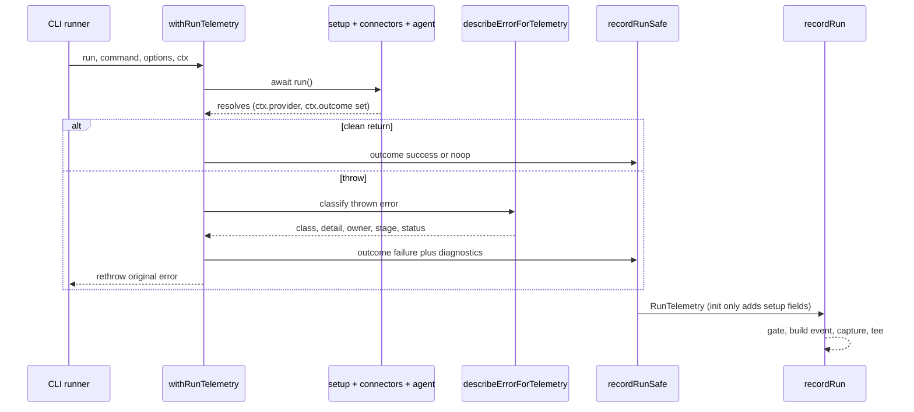

# Telemetry and Diagnostics

OpenWiki ships an **opt-out**, **anonymous**, **aggregate** usage telemetry
pipeline. It emits exactly one event — `openwiki_run` — per completed `init` or
`update` run, carrying the command, outcome, environment provenance, and (on
failure) a closed-set error classification. No file contents, repository data,
credentials, prompts, model output, IP address, or personal information ever
leave the process. This page documents the gating/opt-out model, the single
run-telemetry boundary, the error taxonomy, the PostHog senders, and the
anonymity guarantees baked into each of them.

The module surface is re-exported from `src/telemetry/index.ts`; the important
pieces are the gates (`gates.ts`), the install id (`install-id.ts`), the run
wrapper (`with-run-telemetry.ts`), the run-fact bridge (`record-run-safe.ts`),
the event builder and sender (`senders.ts`, `client.ts`), and the error
taxonomy (`errors.ts`, `taxonomy.ts`).

## Opt-out and gating

Telemetry is on by default and disabled by an explicit switch. `isTelemetryDisabled`
returns true when either `OPENWIKI_TELEMETRY_DISABLED` or the cross-tool
`DO_NOT_TRACK` environment variable is set to a truthy value ("0", "false", and
empty are treated as unset). When disabled, `recordRun` short-circuits before
building or sending any event.

CI is treated differently from opt-out. `isCiEnvironment` (delegating to
`ci-info`, plus the `OPENWIKI_SCHEDULED` escape hatch) still lets events be
sent, but they are tagged `ci: true` and attributed to a **per-provider
sentinel id** (`ci-<provider>`, e.g. `ci-github-actions`) rather than a unique
install id, so ephemeral runners never inflate the human install count. Only an
explicit opt-out stops sending.

Every event is also stamped with distribution provenance so the dashboard can
separate real usage from noise: `isProductionBuild` (true only when running from
`dist/`, deliberately based on build origin rather than `NODE_ENV`) drives the
`production` flag, and `buildChannel()` reports `"official"` only for
npm-published upstream builds (the release pipeline rewrites the committed
`"community"` value via `scripts/stamp-build-channel.cjs`) so fork-originated
telemetry can be filtered out.

## Install id and the first-run notice

Identity is a **persistent, anonymous per-machine install id**: a random UUID
with no relationship to the user, machine, or repository, stored at
`~/.openwiki/install-id` with owner-only permissions (`0o600`, home dir `0o700`).
`getOrCreateInstallId` mints it lazily on first use and reports `isNew: true`
only on the run that created it.

That `isNew` signal drives the one-time disclosure. `firstRunNoticePending`
returns true only on the first run on a machine, and returns false (minting no
id) when telemetry is disabled or in CI (`noticeSuppressed`). It never throws.
The CLI (`cli.tsx`) calls it once at startup before any event is sent, and
renders the disclosure copy — single-sourced as `FIRST_RUN_NOTICE_BODY`,
`FIRST_RUN_NOTICE_OPT_OUT`, and `FIRST_RUN_NOTICE_VERIFY` in `config.ts` — as an
Ink box in the interactive TUI or plain framed text on stderr for print mode.

## The single run-telemetry boundary

`withRunTelemetry` is the **sole place** an `openwiki_run` event is recorded. It
wraps the whole `setup -> connectors -> agent` sequence a caller performs (see
`cli/runners.ts` and `ingestion/ingestion.ts`), so a throw anywhere in that
sequence — repo setup, connector pull, agent prologue, or the agent itself — is
recorded exactly once, closing the pre-agent coverage holes where a throw
previously reached no telemetry.

It threads a mutable `RunTelemetryContext` through the run. The agent publishes
the resolved `provider` onto it the instant provider resolution succeeds (so a
later failure still attributes the right provider), and publishes a `noop`
outcome when an update short-circuits unchanged. On a clean return the wrapper
records the published outcome (defaulting to `success`); on a throw it records
`failure` with the anonymous diagnostics from `describeErrorForTelemetry`, then
**rethrows** so the CLI still owns the failure UX. Telemetry itself never
throws.

Caption: one run flows through the single telemetry boundary; a failure is
classified and recorded once, then rethrown to the caller.

`recordRunSafe` is the bridge between the run lifecycle and telemetry. It
**drops chat** (interactive, would emit one event per turn) so only `init` and
`update` produce events, maps the agent output mode to the brain `mode`, and
attaches the setup fields (`mode`, `provider`, `configuredConnectors` from the
connector registry) **on init only** — the configuration moment — omitting them
on updates. Like `recordRun`, it never throws.

## Building and sending the event

`buildRunEvent` is the pure, single source of truth for the `openwiki_run`
payload: given a run's facts and its environment context it returns the exact
event sent to PostHog, performing no IO and reading no process state, so the
production sender and the telemetry seed script cannot drift apart. Setup and
failure fields are spread in only when present, so update payloads and
successful runs omit them entirely. Configured connectors are flattened into
boolean `connector_<id>` properties (present = configured) rather than an array,
making connector adoption a point-and-click dimension.

`recordRun` orchestrates the send: it gates on opt-out, resolves identity
(install id for humans, sentinel for CI), builds the event, captures it, and
optionally tees the exact payload to `--telemetry-file`. It swallows all its own
errors.

The actual send lives in `capture` (`client.ts`). It uses PostHog's
`captureImmediate` — whose returned promise **is** the single HTTP request —
awaited under a `FLUSH_TIMEOUT_MS` (3s) bound, deliberately not the queued
`capture()` + flush-on-`shutdown()` path, which can resolve without the event
landing and silently drop events. Because the CLI emits exactly one event and
exits, the immediate awaited send is both simplest and most reliable. The
timeout guarantees telemetry can never stall a run, and the client is shut down
afterward (also bounded) so the process can exit promptly.

### `--telemetry-file` tee

`recordRun` writes the exact record (including the assembled event) to the path
given by `--telemetry-file` so users can verify what is captured. The write is
security-hardened: it writes to an unguessable, owner-only (`0o600`) scratch
sibling opened with `flag: "wx"` (refusing to open through a pre-planted
symlink) and atomically `rename`s it into place, defeating symlink attacks and
permission leakage in shared directories like `/tmp`. A failed tee logs to
stderr but never fails the run.

## Anonymity envelope

Anonymity is enforced structurally, not by convention:

- **No PostHog person.** Every event sets `$process_person_profile: false`, so
  PostHog never builds a person; unique-install counts still work off the random
  install-id `distinctId`. Person-profile features like retention are forgone.
- **No IP / geo.** The send passes `disableGeoip: true`; the raw client IP is
  additionally discarded server-side by the project's "Discard client IP data"
  setting.
- **Closed-set fields only.** Command, outcome, mode, owner, class, stage, and
  build channel are closed enums; connectors are booleans; version and HTTP
  status are bare values. **Raw error strings, messages, provider strings, and
  free text never enter the payload** — the error path emits only enum members
  and bare integers.

## Error taxonomy

On failure, `describeErrorForTelemetry` produces five fields — `errorClass`,
`errorDetail`, `errorStage`, `errorOwner`, and `httpStatus` — from the thrown
value without ever emitting its message.

**Class (the failure family).** `TelemetryErrorClass` is a closed set
(`config_error`, `filesystem_error`, `provider_error`, `network_error`,
`context_limit_error`, `build_error`, `connector_error`, `okf_error`,
`checkpointer_error`, `tool_error`, `output_error`, `agent_error`, `aborted`).
`agent_error` is the residual bucket for anything that matched no rule and is
the quality meter that should trend toward zero. The class comes from the
**origin tag** when a throw site owned its classification (build/connector/okf/
checkpointer, or a tagged config/tool detail), otherwise from `classifyError`.

**Origin tagging.** `inStage` / `inStageSync` bracket a pipeline stage and stamp
any thrown error with an `ErrorOriginTag` carried on a **non-enumerable symbol**
(so it never serializes into a payload or JSON dump). The tag records the
`stage` (`config -> build -> run -> finalize`) and, for owned families, the
class and detail decided where the error was thrown rather than guessed from a
message. First tag wins, so the innermost origin is preserved as the error
unwinds.

**Chain-walking classification.** Errors are frequently wrapped (framework
envelopes, `cause` chains, `AggregateError`). `unwrapErrorChain` flattens the
error into a nearest-first, cycle-safe, depth-bounded (`MAX_UNWRAP_DEPTH = 32`)
list of links. `classifyError` returns the first link that yields a named class
(so a provider error hidden inside a tool wrapper is recovered), `readErrorOrigin`
returns the first link whose tag names an owned family (so an owned error
re-wrapped by LangChain's `MiddlewareError`, which strands the tag on `.cause`,
keeps its class), and `firstStatusInChain` surfaces the nearest HTTP status even
when the top wrapper carries none.

**The stream-open exception.** A `build_error/stream_open` origin tag is the one
override: that stage is the first provider round trip, so a failure there
carrying a provider signal (a `provider_error` classification, or an HTTP status
paired with any named class) is treated as a disguised provider error and the
raw classification wins over the tag — while a genuine stream-setup failure with
no provider signal keeps its informative tag.

**Detail (the specific failure).** `errorDetail` is the specific failure inside
the family, and it is the **anonymity spine**. `normalizeErrorDetail` validates
each observed detail against `taxonomy.ts`'s hardcoded per-family allowlist
(`FIXED_ERROR_DETAILS`) and drops anything off-list to `undefined` rather than
emitting it raw. Two families (`connector_error`, `tool_error`) carry a registry
id validated at the tag site instead of a fixed word. For the residual
`agent_error` bucket the detail is instead the **innermost error's own name**
(`innermostErrorName`), gated by `isSafeErrorIdentifier` — a bare identifier of
at most 64 chars matching a strict pattern — so a `.name` or `constructor.name`
carrying a path, URL, space, or user value is rejected and the envelope stays
closed.

**Owner (whose fix it is).** `deriveOwner` is the single source of owner truth,
mapping (class, detail, stage) to `environment`, `provider`, `openwiki`,
`unowned`, or `control`. It encodes the cross-owner exceptions PostHog cannot
derive: `provider_error` details `auth`/`quota_exceeded` route to `environment`
(the user's key/account), `network_error` details `dns`/`refused` route to
`environment` (the user's machine), and `filesystem_error` at the `finalize`
stage routes to `openwiki` (our own wiki write path). Owner is emitted so the
health dashboard can roll failures up by who must act.

## Testing

The behavior that matters is exercised under `test/telemetry/`: the event shape
and gating in `telemetry.test.ts` (with `posthog-node` and `ci-info` mocked so
nothing hits the network and CI detection is deterministic), the run wrapper in
`with-run-telemetry.test.ts`, the run-fact bridge in `record-run-safe.test.ts`,
the no-key send path in `client-no-key.test.ts`, and the install-id lifecycle in
`telemetry-install-id.test.ts`.

## Related pages

- [Architecture Overview](../architecture/overview.md)
- [Configuration](./configuration.md)
- [Testing Overview](../testing/overview.md)
