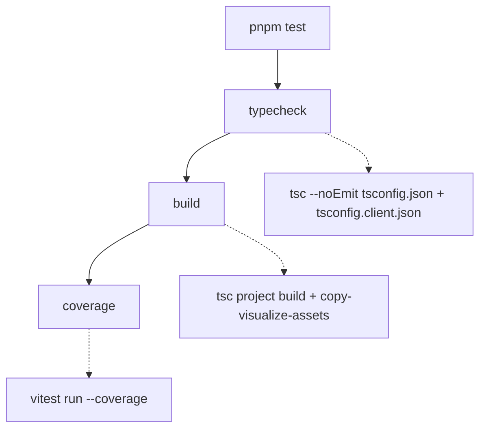

# Testing Guide

OpenWiki is validated by a single [Vitest](https://vitest.dev) suite under `test/`.
The suite is fast, mostly offline (external services and SDKs are stubbed), and
mirrors the `src/` tree directory-for-directory so that the tests for a subsystem
live at the matching path. This page explains the tooling, the full `pnpm test`
pipeline, and — for each subsystem — the narrowest command that proves a change
while preserving complete failure output.

## Tooling

- **Test runner: Vitest.** `vitest` (and `@vitest/coverage-v8`) are dev
  dependencies; there is no separate framework. Tests import `describe`,
  `expect`, `test`, `vi`, and the `beforeEach`/`afterEach` hooks directly from
  `vitest`.
- **Ink component tests: ink-testing-library.** Terminal UI written with Ink is
  exercised by rendering React components with `render` from
  `ink-testing-library` and asserting on the rendered frame (`lastFrame()`).
  These tests are the `.tsx` files under `test/cli/components/` and
  `test/setup/credentials/`.
- **No global config beyond `vitest.config.ts`.** Test discovery keeps Vitest's
  defaults; the only tuning is one discovery exclusion and the coverage block
  (see below).

Tests import source modules directly by relative path (for example
`../../src/agent/index.ts`), so a source module can be unit-tested without
building `dist/` first. `tsx` runs the CLI in development (`pnpm dev`), but the
test suite itself runs through Vitest's own transform.

## The `pnpm test` pipeline

`pnpm test` is not just the unit run — it is a three-stage gate that must pass in
order:

The `pnpm test` gate: typecheck, then build, then the coverage run.

1. **`typecheck`** runs `tsc --noEmit` against both the server project
   (`tsconfig.json`) and the browser/client project (`tsconfig.client.json`).
2. **`build`** compiles both TypeScript projects and copies the visualize
   client assets.
3. **`coverage`** runs `vitest run --coverage`, which executes every test and
   produces a coverage report.

When iterating locally you usually do **not** want the whole gate. Run Vitest
directly (`pnpm exec vitest run <path-or-pattern>`) to execute a focused slice,
then run `pnpm test` once before proposing the change so typecheck, build, and
coverage all agree.

## Coverage configuration

Coverage uses the V8 provider with `all: true` and an explicit
`include: ["src/**/*.{ts,tsx}"]`. `all: true` plus the explicit include makes the
report cover the **entire** `src` tree, so a source file that no test imports yet
appears as 0% rather than being silently omitted from the denominator.

A small set of files are deliberately excluded from coverage because they emit no
runtime JavaScript or can only run in an environment a Node unit test cannot
drive: `*.d.ts`, pure `types.ts` declaration modules, the `telemetry/index.ts`
re-export barrel, the browser-only `visualize/client.ts`, and the Ink keyboard
state machine `setup/credentials/use-init-setup.ts`. In each excluded case the
extractable pure logic lives in a separate, tested module (for example
`visualize/client-lib.ts`, or `steps.ts`/`format.ts`/`persistence.ts` for the
setup wizard), so new logic belongs in those tested modules rather than in the
excluded glue. The coverage reporters are `text`, `text-summary`, `html`,
`json-summary`, and `lcov`.

## Test discovery

Vitest keeps its default discovery globs and adds exactly one exclusion:
`**/benchmarks/*/repo/**`. A KEB benchmark under `evals/keb/benchmarks/` can
rebuild an upstream project's source tree into a `repo/` directory that carries
that project's own `*.test.ts` files. Those belong to the fixture under test, not
to OpenWiki, so the exclusion guarantees that a benchmark whose `repo/` happens
to be present on disk cannot pollute this project's suite.

## Test layout maps to source subsystems

`test/` mirrors `src/`. To find (or add) tests for a subsystem, go to the
matching path. The most important mappings:

| Test directory                                                                                                                                            | Source subsystem it validates                                                                                 |
| --------------------------------------------------------------------------------------------------------------------------------------------------------- | ------------------------------------------------------------------------------------------------------------- |
| `test/agent/`                                                                                                                                             | `src/agent/` — model creation, middleware, prompts, streaming, redaction, the repository runner, update-noop fast-skip, repository source fingerprinting, OKF middleware, frontmatter validation, and the wiki finalizer |
| `test/claims/`                                                                                                                                            | `src/claims/` — grounded-claim core, the code claim brain, and evidence resolution                            |
| `test/connectors/`                                                                                                                                        | `src/connectors/` — connector config, resilient fetch, MCP client/runtime, and per-source ingestion           |
| `test/generation/`                                                                                                                                        | `src/generation/` — repository run lifecycle, page planning, page-manifest persistence, and run-state persistence                                 |
| `test/okf/`                                                                                                                                              | `src/okf/` — OKF frontmatter parsing/normalization/repair/validation and index labels/sync |
| `test/integrations/`                                                                                                                                      | `src/integrations/` — host installers, config adapters, the MCP server, and packaged skill/protocol contracts |
| `test/cli/`                                                                                                                                               | `src/cli/` — CLI wiring and Ink components                                                                    |
| `test/setup/`                                                                                                                                             | `src/setup/` — the credentials setup wizard                                                                   |
| `test/visualize/`                                                                                                                                          | `src/visualize/` — the live-server/static-export HTML page, graph payload, server, static export, client-lib pure logic, and browser client interaction wiring |
| `test/config/`, `test/mermaid/`, `test/scheduling/`, `test/telemetry/`, `test/auth/`, `test/ingestion/`, `test/platform/` | the matching `src/` subsystem                                                                                 |

Related architecture and subsystem pages: the
[source map](../architecture/source-map.md),
[grounded claims](../concepts/grounded-claims.md),
[coding-agent integrations](../integrations/coding-agents.md), and the
[repository generation workflow](../workflows/repository-generation.md).

### Agent: middleware, frontmatter, and finalizer

The agent subsystem directory holds a broad set of tests, including several that
guard the OKF authoring pipeline added in the v0.4.0 cycle:

- `test/agent/frontmatter-validator.test.ts` exercises `validateOkfFrontmatter`
  in isolation, asserting which OKF frontmatter families are accepted (required
  `type`, optional `title`/`description`/`resource`/`tags`, the legacy v0.1
  `timestamp`/producer extensions, and the v0.2 provenance/trust/lifecycle
  families) and which malformed inputs are rejected (timestamps without an
  explicit UTC offset, impossible ISO-shaped timestamps).
- `test/agent/index-middleware.test.ts` drives `createOpenWikiIndexMiddleware`
  against a real `OpenWikiLocalShellBackend` rooted in an `mkdtemp` directory. It
  runs the middleware's `beforeAgent`/`afterAgent` lifecycle hooks, asserts the
  projected source IDs and index labels, and feeds broken Mermaid blocks to prove
  index sync fails on unparseable diagrams.
- `test/agent/wiki-finalizer.test.ts` exercises `prepareWikiForAuthoring` and
  `finalizeWikiArtifacts` against an isolated repository-mode backend, capturing
  the operation sequence (`migrate`, `provenance_snapshot`) and asserting on the
  persisted content written to the real filesystem.
- `test/agent/repository-runner.test.ts` drives `runNativeRepositoryGeneration`
  through a `deepagents`/`repository-run.js` mock harness. It asserts the
  shell-free tool surface and one fresh worker per page, and includes the
  worker-exit/skip regression `restores and leaves a page pending when its
  worker does not submit`: when a page worker exits without calling
  `submit_page`, the runner invokes `captureRepositoryPageSnapshot`/
  `skipRepositoryPage` to restore the captured snapshot, marks that page
  `skipped`, finishes the run, and emits a `text` event telling the user the
  page will be "reconsidered on the next update" — leaving the skipped page to
  be re-queued as `pending` on resume.
- `test/agent/update-noop.test.ts` is the dedicated suite for the update no-op
  fast-skip path: it builds a real committed Git repository with an OpenWiki
  tree and exercises `getUpdateNoopStatus` across the conditions that should and
  should not skip (unchanged HEAD, output-language change, equivalent
  primary-language request, committed-only dirty run metadata, page-manifest
  migration, uncommitted worktree changes, ignored-only paths, OpenWiki-only
  commits). It also guards the metadata-refresh path so a skip preserves the
  persisted language (mirroring `runOpenWikiAgent`'s `writeLastUpdateMetadata`
  refresh) and covers `shouldCheckUpdateNoop`'s gating conditions.
- `test/agent/repository-source-fingerprint.test.ts` exercises
  `createRepositorySourceFingerprint`/`createRepositorySourceSnapshot` and
  `getRepositoryChangedPaths` against a committed Git repository in `mkdtemp`.
  It pins fingerprint stability, sensitivity (tracked/staged/unstaged content,
  deletions, untracked files, executable-bit, symlink-target changes,
  `.openwikiignore` rules), the exclusion of generated pages/Claims
  sidecars/run metadata, and a TOCTOU race where an inspected file becomes a
  symlink before opening — it injects that race by wrapping `node:fs/promises`
  with `vi.mock` and asserts the fingerprinter fails closed rather than
  following the swapped target.

### Claims: nested layout

`test/claims/` splits by the claims subsystem's own internal boundaries:
`test/claims/core/` (the resolver-agnostic mutation and error model, e.g.
`applyClaimOperations`/`cloneClaims`), `test/claims/brains/code/` (the code claim
brain — paths, preflight, runtime, session, store), and
`test/claims/evidence/repository/` (repository evidence resource parsing and the
resolver). This mirrors the `src/claims/` split between core, brain, and evidence
concerns.

### Connectors: shared machinery vs. per-source

`test/connectors/` keeps cross-cutting machinery at the top level
(`connector-config*`, `fetch-with-resilience`, `mcp-client`, `mcp-runtime`,
`raw-connector-tools`, `tools`) and puts each individual source under
`test/connectors/sources/` (git-repo, gmail, hackernews, mcp, slack, web-search,
x, langsmith, custom-mcp). A source's pure logic is often private and only
observable through its `ingest()` entry point, so those tests point `$HOME` at a
throwaway temp directory, feed controlled API responses through a stubbed
`fetch`, and assert on the request the connector builds and the normalized raw
dump it writes to disk — no real network call or OAuth token is involved. To add
a new connector, use the `write-connector` skill and add a matching test under
`test/connectors/sources/`.

### OKF: frontmatter and index

`test/okf/` mirrors `src/okf/`. `test/okf/frontmatter.test.ts` is the broadest
OKF frontmatter suite: it covers `normalizeConceptContent` (regenerating
frontmatter for bare pages, repairing optional fields while preserving
producer-defined extensions, stamping a localized concept type), and the
`parseFrontmatterFields`/`renderFrontmatter`/`validateOkfFrontmatter`/
`repairOkfFrontmatter`/`validatePersistedFile` helpers. Sibling files
(`test/okf/index-labels.test.ts`, `test/okf/index-sync-errors.test.ts`,
`test/okf/claims-verification.test.ts`, `test/okf/claim-sources.test.ts`) cover
index labels, index-sync error paths, and claims verification/source projection.

### Generation: planning, manifests, run state, and the run lifecycle

`test/generation/` splits the repository-generation machinery by persistence
concern, mirroring `src/generation/`:

- `test/generation/page-manifest.test.ts` covers the page-manifest persistence
  and completion surface (`readRepositoryPageManifest`,
  `writeRepositoryPageManifest`, `replaceRepositoryPageManifest`,
  `recordRepositoryPageCompletion`, `seedRepositoryPageManifest`,
  `isRepositoryPageCompletionCurrent`, atomic-rename replacement). It injects a
  manifest-rename failure by wrapping `node:fs/promises` with `vi.mock` and
  asserts the manifest is not left in a half-written state, and refuses to
  advance an unverified or mismatched Claims page while recording the exact
  verified page bytes and source checkpoint on success.
- `test/generation/run-state.test.ts` covers `writeRepositoryRunState`/
  `readRepositoryRunState`/`removeRepositoryRunState` against a temp root: the
  atomic write/read, validation rejection (a wrong `schemaVersion` must not
  replace durable state), and temp-file cleanup when rename fails.
- `test/generation/page-jobs.test.ts` exercises `createRepositoryPlan` and
  `replacePageClaims` through a `ClaimSession` with a deterministic evidence
  resolver, pinning plan construction and page-claim replacement.
- `test/generation/repository-run.test.ts` is the end-to-end run-lifecycle test
  described in detail below.

### Ingestion: code-mode setup and connectors

`test/ingestion/` mirrors `src/ingestion/`. `test/ingestion/code-mode.test.ts`
exercises `ensureCodeModeRepoSetup` and `runCodeModeConnectors` against temp
repositories: it parses the generated GitHub Actions workflow YAML, pins the
agent files and workflow/provider blocks, and asserts the OpenWiki
`<!-- OPENWIKI:START -->`/`<!-- OPENWIKI:END -->` snippet contract. Sibling files
(`test/ingestion/ingestion-run.test.ts`, `test/ingestion/ingestion.test.ts`,
`test/ingestion/langsmith-modes.test.ts`) cover the ingestion run,
`parseIngestionTarget`/`createConnectorSynthesisGuidance`, and connector modes.

### Visualize: page, graph, and client interaction

`test/visualize/` mirrors `src/visualize/`. It splits the visualizer into the
parts that can run in plain Node and the browser-only client glue that cannot:

- `test/visualize/page.test.ts` asserts on the rendered `PAGE`/`STATIC_PAGE`
  HTML documents exported by `src/visualize/page.ts`. It pins the exact CDN
  script versions (force-graph, marked, dompurify, mermaid) and requires each
  `<script>` tag to carry an SRI `integrity` plus `crossorigin="anonymous"`
  attribute, so a version bump is forced through this test with a fresh hash
  review rather than silently trusting the CDN. It also guards the issue #670
  overlay-layout regression: the hint and legend must live inside the `#graph`
  panel (not direct children of `.main`) and the stylesheet must height-cap
  `.graph-overlay` with a scrollable `.legend`.
- `test/visualize/client-interaction.test.ts` is a `@vitest-environment jsdom`
  suite for the browser-only `src/visualize/client.ts` interaction wiring.
  Because `client.ts` touches the DOM and CDN globals at import time, the test
  mounts a minimal DOM matching `page.ts`'s post-#670 layout, replaces the
  third-party globals (`ForceGraph`, `marked`, `DOMPurify`, `mermaid`,
  `ResizeObserver`, `fetch`) with recording stubs, imports the client under
  `data-static-export`, and asserts on the handlers it registers. Its primary
  target is the issue #670 regression: background clicks must not be wired to
  any handler, so clicking blank graph space never clears the reader, while
  node clicks select a page and highlight its sidebar entry.

## Testing patterns you will reuse

- **Dependency injection via `vi.mock` + `vi.hoisted`.** Failure-path tests
  wrap a real module with `vi.mock(..., importOriginal)` and use a hoisted
  counter to inject a failure on the Nth call while otherwise delegating to the
  real implementation. `test/generation/repository-run.test.ts` arms a
  `failureHarness` with six counters — `manifestReplacements`,
  `manifestWrites`, `metadataWrites`, `stateWrites`, `stateRemovals`, and
  `sourceMutationsAfterManifestReplacement` — that wrap `page-manifest.js`
  (`recordRepositoryPageCompletion` for `manifestWrites`,
  `replaceRepositoryPageManifest` for `manifestReplacements` plus a
  mid-replacement source mutation for `sourceMutationsAfterManifestReplacement`),
  `agent/utils.js` (`writeLastUpdateMetadata` for `metadataWrites`), and
  `run-state.js` (`writeRepositoryRunState`/`removeRepositoryRunState` for
  `stateWrites`/`stateRemovals`) to inject manifest-, metadata-, and run-state
  write/removal failures and prove the runner's recovery and rollback behavior.
  These tests import the source modules directly (e.g.
  `../../src/okf/frontmatter.ts`, `../../src/generation/repository-run.ts`) so
  the run lifecycle is exercised through Vitest's transform without first
  building `dist/`.
- **Real filesystem in a temp dir.** Tests that exercise on-disk behavior create
  an OS temp directory (`mkdtemp`), redirect `$HOME`/`USERPROFILE` or
  `OPENWIKI_CONFIG_DIR` into it, and clean up in `afterEach`. This keeps the
  suite hermetic without mocking `fs`.
- **Ink render assertions.** Component tests render with `ink-testing-library`
  and assert on `lastFrame()`, stripping ANSI first (via the shared
  `test/cli/components/ansi.ts` helper) so assertions match plain text.
- **DOM shim for Mermaid.** Tests that touch Mermaid validation call
  `ensureDomGlobals()` from `src/mermaid/dom-shim.ts` to install jsdom's
  window/document globals.

### The repository-run lifecycle test

`test/generation/repository-run.test.ts` is the end-to-end integration test for
the repository generation workflow. It imports `parseFrontmatterFields` and
`validateOkfFrontmatter` from `src/okf/frontmatter.ts`, plus the run lifecycle
(`beginRepositoryRun`, `submitRepositoryPlan`, `nextRepositoryPage`,
`submitRepositoryPage`, `finishRepositoryRun`) and the skip primitives
(`captureRepositoryPageSnapshot`, `skipRepositoryPage`) from
`src/generation/repository-run.ts`, and drives the full begin → submit_plan →
next_page → submit_page → finish lifecycle against a temporary Git repository.
A `failureHarness` created with `vi.hoisted` wraps the real `page-manifest.js`,
`agent/utils.js`, and `run-state.js` modules to inject failures on selected
calls while otherwise delegating to the real implementation (see the testing
patterns above). Each test creates a committed Git repository (via the
`git`/`createRepository` helpers), optionally arms the failure counters in
`beforeEach`, and removes the temporary directories in `afterEach`, so the run's
recovery and rollback paths are exercised against a real repository without
leaving state behind.

The suite also covers the **skip path** for a page whose worker does not submit:
`captureRepositoryPageSnapshot` snapshots the on-disk Markdown and Claims before
the page is mutated, `skipRepositoryPage` restores that snapshot and marks the
page `skipped` (the `restores the exact pending Markdown and Claims snapshot`
test), and `finishRepositoryRun` accepts a `skippedPageSnapshots` list so a
finish-after-skip leaves the original content and Claims in place, drops run
state, and stamps an `interrupted` last-update status. A separate
`resets an interrupted skipped job to pending on resume` test proves that
resuming a run whose first page was skipped re-queues that page as `pending`
rather than carrying the skipped status forward.

## Choosing the narrowest validation per subsystem

Run the smallest slice that would fail if your change is wrong, then run the full
`pnpm test` gate before finishing. Use `pnpm exec vitest run <path>` to scope by
file or directory, or `-t "<name>"` to scope by test name.

- **A single subsystem:** `pnpm exec vitest run test/generation/` (swap in the
  matching directory from the table above).
- **A single file:** `pnpm exec vitest run test/agent/repository-runner.test.ts`.
- **A single connector source:** `pnpm exec vitest run test/connectors/sources/slack.test.ts`.
- **A single named test:** `pnpm exec vitest run test/config -t "treats whitespace-only overrides as unset"`.
- **Ink components:** `pnpm exec vitest run test/cli/components/`.
- **Generation skip/restore path:** `pnpm exec vitest run test/generation/repository-run.test.ts -t "restores the exact pending Markdown and Claims snapshot"` (snapshot restore + `finishRepositoryRun` with `skippedPageSnapshots`) or `-t "resets an interrupted skipped job to pending on resume"` (resume re-queueing).
- **Agent worker-exit/skip path:** `pnpm exec vitest run test/agent/repository-runner.test.ts -t "restores and leaves a page pending when its worker does not submit"`.
- **Update no-op fast-skip:** `pnpm exec vitest run test/agent/update-noop.test.ts`.
- **Source fingerprinting / changed paths:** `pnpm exec vitest run test/agent/repository-source-fingerprint.test.ts`.
- **Page manifest persistence:** `pnpm exec vitest run test/generation/page-manifest.test.ts`.
- **Run-state persistence:** `pnpm exec vitest run test/generation/run-state.test.ts`.
- **Code-mode ingestion setup:** `pnpm exec vitest run test/ingestion/code-mode.test.ts`.
- **Visualizer client interaction regression:** `pnpm exec vitest run test/visualize/client-interaction.test.ts` (jsdom; run `test/visualize/` for the full page/graph/client-lib slice).

Because tests import `src/` directly, a focused Vitest run does not require a
prior `pnpm build`. Reserve the full `pnpm test` (typecheck + build + coverage)
for confirming the change end-to-end.

### Preserve complete failure output

When a scoped run fails, capture the **entire** Vitest failure block — the failed
test name, the full assertion diff (expected vs. received), and the complete stack
trace — not a summarized line. The diff and stack are what let a reviewer or
follow-up run locate the regression. Do not truncate an assertion diff or drop
stack frames when reporting a failure.

## End-to-end and gated tests

Most of the suite is offline unit and integration tests. A small number of files
are named `*.e2e.test.ts` (for example
`test/agent/gemini-enterprise-claude.e2e.test.ts`) and exercise a real vendor SDK
path rather than a mock — that test drives the real Anthropic Vertex SDK plus the
real Mermaid DOM shim to guard the browser-guard workaround, using a throwaway
offline credentials file so no real token or network request is involved. These
still run in the default suite; they are named to signal that they cross an
integration boundary rather than testing a unit in isolation.
