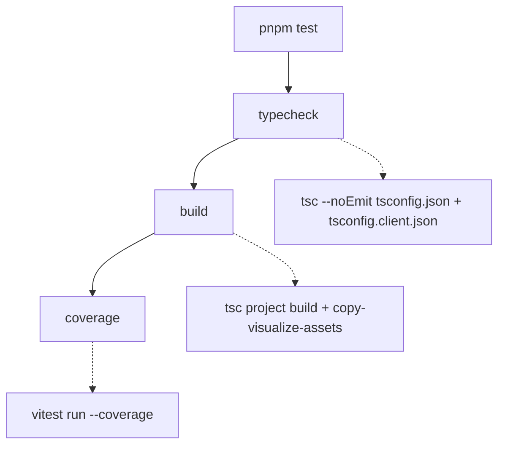

# Testing Guide

OpenWiki is validated by a single [Vitest](https://vitest.dev) suite under `test/`.
The suite is fast, mostly offline (external services and SDKs are stubbed), and
mirrors the `src/` tree directory-for-directory so that the tests for a subsystem
live at the matching path. This page explains the tooling, the full `pnpm test`
pipeline, and — for each subsystem — the narrowest command that proves a change
while preserving complete failure output.

## Tooling

- **Test runner: Vitest.** `vitest` (and `@vitest/coverage-v8`) are dev
  dependencies; there is no separate framework. Tests import `describe`,
  `expect`, `test`, `vi`, and the `beforeEach`/`afterEach` hooks directly from
  `vitest`.
- **Ink component tests: ink-testing-library.** Terminal UI written with Ink is
  exercised by rendering React components with `render` from
  `ink-testing-library` and asserting on the rendered frame (`lastFrame()`).
  These tests are the `.tsx` files under `test/cli/components/` and
  `test/setup/credentials/`.
- **No global config beyond `vitest.config.ts`.** Test discovery keeps Vitest's
  defaults; the only tuning is one discovery exclusion and the coverage block
  (see below).

Tests import source modules directly by relative path (for example
`../../src/agent/index.ts`), so a source module can be unit-tested without
building `dist/` first. `tsx` runs the CLI in development (`pnpm dev`), but the
test suite itself runs through Vitest's own transform.

## The `pnpm test` pipeline

`pnpm test` is not just the unit run — it is a three-stage gate that must pass in
order:

The `pnpm test` gate: typecheck, then build, then the coverage run.

1. **`typecheck`** runs `tsc --noEmit` against both the server project
   (`tsconfig.json`) and the browser/client project (`tsconfig.client.json`).
2. **`build`** compiles both TypeScript projects and copies the visualize
   client assets.
3. **`coverage`** runs `vitest run --coverage`, which executes every test and
   produces a coverage report.

When iterating locally you usually do **not** want the whole gate. Run Vitest
directly (`pnpm exec vitest run <path-or-pattern>`) to execute a focused slice,
then run `pnpm test` once before proposing the change so typecheck, build, and
coverage all agree.

## Coverage configuration

Coverage uses the V8 provider with `all: true` and an explicit
`include: ["src/**/*.{ts,tsx}"]`. `all: true` plus the explicit include makes the
report cover the **entire** `src` tree, so a source file that no test imports yet
appears as 0% rather than being silently omitted from the denominator.

A small set of files are deliberately excluded from coverage because they emit no
runtime JavaScript or can only run in an environment a Node unit test cannot
drive: `*.d.ts`, pure `types.ts` declaration modules, the `telemetry/index.ts`
re-export barrel, the browser-only `visualize/client.ts`, and the Ink keyboard
state machine `setup/credentials/use-init-setup.ts`. In each excluded case the
extractable pure logic lives in a separate, tested module (for example
`visualize/client-lib.ts`, or `steps.ts`/`format.ts`/`persistence.ts` for the
setup wizard), so new logic belongs in those tested modules rather than in the
excluded glue. The coverage reporters are `text`, `text-summary`, `html`,
`json-summary`, and `lcov`.

## Test discovery

Vitest keeps its default discovery globs and adds exactly one exclusion:
`**/benchmarks/*/repo/**`. A KEB benchmark under `evals/keb/benchmarks/` can
rebuild an upstream project's source tree into a `repo/` directory that carries
that project's own `*.test.ts` files. Those belong to the fixture under test, not
to OpenWiki, so the exclusion guarantees that a benchmark whose `repo/` happens
to be present on disk cannot pollute this project's suite.

## Test layout maps to source subsystems

`test/` mirrors `src/`. To find (or add) tests for a subsystem, go to the
matching path. The most important mappings:

| Test directory                                                                                                                                            | Source subsystem it validates                                                                                 |
| --------------------------------------------------------------------------------------------------------------------------------------------------------- | ------------------------------------------------------------------------------------------------------------- |
| `test/agent/`                                                                                                                                             | `src/agent/` — model creation, middleware, prompts, streaming, redaction, the repository runner               |
| `test/claims/`                                                                                                                                            | `src/claims/` — grounded-claim core, the code claim brain, and evidence resolution                            |
| `test/connectors/`                                                                                                                                        | `src/connectors/` — connector config, resilient fetch, MCP client/runtime, and per-source ingestion           |
| `test/generation/`                                                                                                                                        | `src/generation/` — repository planning, page jobs, and run-state persistence                                 |
| `test/integrations/`                                                                                                                                      | `src/integrations/` — host installers, config adapters, the MCP server, and packaged skill/protocol contracts |
| `test/cli/`                                                                                                                                               | `src/cli/` — CLI wiring and Ink components                                                                    |
| `test/setup/`                                                                                                                                             | `src/setup/` — the credentials setup wizard                                                                   |
| `test/config/`, `test/okf/`, `test/mermaid/`, `test/visualize/`, `test/scheduling/`, `test/telemetry/`, `test/auth/`, `test/ingestion/`, `test/platform/` | the matching `src/` subsystem                                                                                 |

Related architecture and subsystem pages: the
[source map](../architecture/source-map.md),
[grounded claims](../concepts/grounded-claims.md),
[coding-agent integrations](../integrations/coding-agents.md), and the
[repository generation workflow](../workflows/repository-generation.md).

### Claims: nested layout

`test/claims/` splits by the claims subsystem's own internal boundaries:
`test/claims/core/` (the resolver-agnostic mutation and error model, e.g.
`applyClaimOperations`/`cloneClaims`), `test/claims/brains/code/` (the code claim
brain — paths, preflight, runtime, session, store), and
`test/claims/evidence/repository/` (repository evidence resource parsing and the
resolver). This mirrors the `src/claims/` split between core, brain, and evidence
concerns.

### Connectors: shared machinery vs. per-source

`test/connectors/` keeps cross-cutting machinery at the top level
(`connector-config*`, `fetch-with-resilience`, `mcp-client`, `mcp-runtime`,
`raw-connector-tools`, `tools`) and puts each individual source under
`test/connectors/sources/` (git-repo, gmail, hackernews, mcp, slack, web-search,
x, langsmith, custom-mcp). A source's pure logic is often private and only
observable through its `ingest()` entry point, so those tests point `$HOME` at a
throwaway temp directory, feed controlled API responses through a stubbed
`fetch`, and assert on the request the connector builds and the normalized raw
dump it writes to disk — no real network call or OAuth token is involved. To add
a new connector, use the `write-connector` skill and add a matching test under
`test/connectors/sources/`.

## Testing patterns you will reuse

- **Dependency injection via `vi.mock` + `vi.hoisted`.** Failure-path tests
  wrap a real module with `vi.mock(..., importOriginal)` and use a hoisted
  counter to inject a failure on the Nth call while otherwise delegating to the
  real implementation. `test/generation/repository-run.test.ts`, for example,
  injects metadata-write and run-state write/removal failures this way to prove
  the runner's recovery behavior.
- **Real filesystem in a temp dir.** Tests that exercise on-disk behavior create
  an OS temp directory (`mkdtemp`), redirect `$HOME`/`USERPROFILE` or
  `OPENWIKI_CONFIG_DIR` into it, and clean up in `afterEach`. This keeps the
  suite hermetic without mocking `fs`.
- **Ink render assertions.** Component tests render with `ink-testing-library`
  and assert on `lastFrame()`, stripping ANSI first (via the shared
  `test/cli/components/ansi.ts` helper) so assertions match plain text.
- **DOM shim for Mermaid.** Tests that touch Mermaid validation call
  `ensureDomGlobals()` from `src/mermaid/dom-shim.ts` to install jsdom's
  window/document globals.

## Choosing the narrowest validation per subsystem

Run the smallest slice that would fail if your change is wrong, then run the full
`pnpm test` gate before finishing. Use `pnpm exec vitest run <path>` to scope by
file or directory, or `-t "<name>"` to scope by test name.

- **A single subsystem:** `pnpm exec vitest run test/generation/` (swap in the
  matching directory from the table above).
- **A single file:** `pnpm exec vitest run test/agent/repository-runner.test.ts`.
- **A single connector source:** `pnpm exec vitest run test/connectors/sources/slack.test.ts`.
- **A single named test:** `pnpm exec vitest run test/config -t "treats whitespace-only overrides as unset"`.
- **Ink components:** `pnpm exec vitest run test/cli/components/`.

Because tests import `src/` directly, a focused Vitest run does not require a
prior `pnpm build`. Reserve the full `pnpm test` (typecheck + build + coverage)
for confirming the change end-to-end.

### Preserve complete failure output

When a scoped run fails, capture the **entire** Vitest failure block — the failed
test name, the full assertion diff (expected vs. received), and the complete stack
trace — not a summarized line. The diff and stack are what let a reviewer or
follow-up run locate the regression. Do not truncate an assertion diff or drop
stack frames when reporting a failure.

## End-to-end and gated tests

Most of the suite is offline unit and integration tests. A small number of files
are named `*.e2e.test.ts` (for example
`test/agent/gemini-enterprise-claude.e2e.test.ts`) and exercise a real vendor SDK
path rather than a mock — that test drives the real Anthropic Vertex SDK plus the
real Mermaid DOM shim to guard the browser-guard workaround, using a throwaway
offline credentials file so no real token or network request is involved. These
still run in the default suite; they are named to signal that they cross an
integration boundary rather than testing a unit in isolation.
