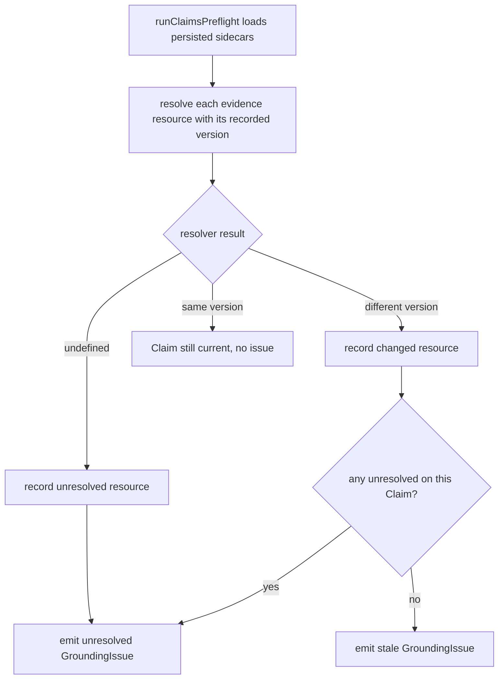
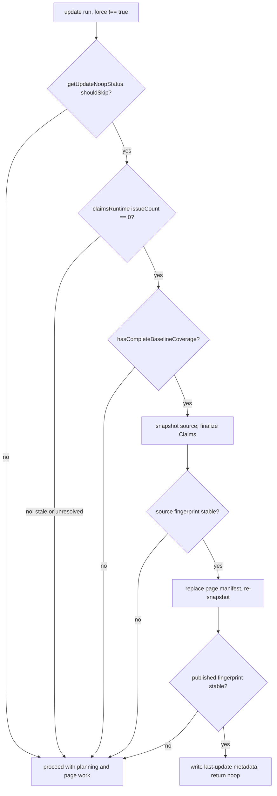
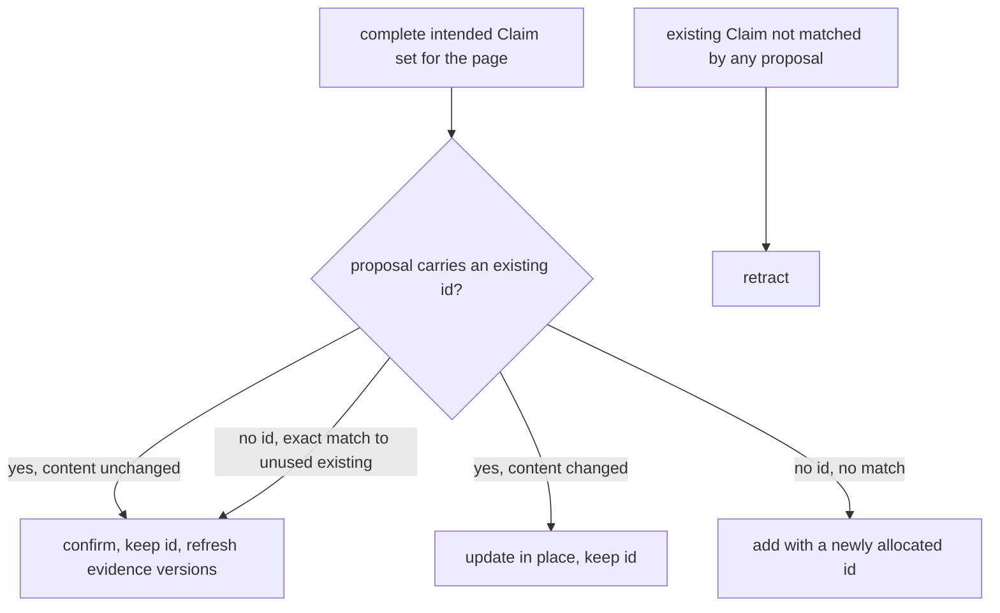
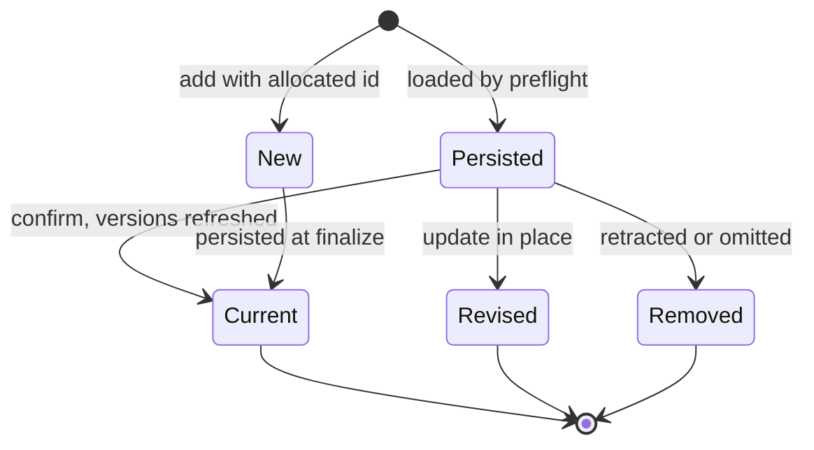

# Claims Reconciliation on Update

An OpenWiki update run does not blindly regenerate pages. Before the model is
invoked it first proves that the persisted [Claims](../concepts/grounded-claims.md)
still match current repository evidence, and when a page is (re)written it
reconciles the worker's **complete intended Claim set** against the page's
persisted Claims instead of replacing them wholesale. Reconciliation is what
lets unchanged propositions keep their stable identifiers and merely refresh
their code-owned evidence versions, while genuinely changed, new, or removed
propositions are updated, created, or retracted.

This page explains two connected mechanisms:

1. **Update no-op detection**, and how stale or unresolved Claims override an
   otherwise skippable run.
2. **Per-page Claim reconciliation**, and the preserve / update / create /
   retract rules the page worker applies.

## Where evidence versions come from

Every persisted Claim carries one or more `evidence` records, each pairing a
canonical `resource` identity with an opaque, resolver-owned `version` token
observed when the Claim was established. Persisted sidecars validate both fields
as canonical non-empty strings, and each page sidecar also stores a
`pageVersion` hash of the Markdown it grounds.

The version token is deliberately opaque: reconciliation compares tokens for
equality but never interprets them. When source changes, the resolver returns a
different token for the same resource, which is how staleness is detected.

## Preflight: checking persisted evidence before any work

Update and resumed-init runs begin by running `runClaimsPreflight`, which loads
every persisted page sidecar and, for each Claim's evidence, resolves the
`resource` against the recorded `version` exactly once per preflight. Each
resource yields one of three outcomes:

- The resolver returns `undefined` — the evidence no longer resolves — and the
  resource is recorded as **unresolved**.
- The resolver returns a **different** version token — the source changed — and
  the resource is recorded as **stale** (`changed`).
- The resolver returns the **same** version token — the Claim is still current
  and produces no issue.

A Claim with any unresolved resource emits an `unresolved` `GroundingIssue`; a
Claim with only changed resources emits a `stale` issue. Resolution _errors_
propagate rather than being swallowed, so a transient failure is never mistaken
for deleted evidence. Preflight also inventories orphan sidecars whose generated
Markdown pages no longer exist. Its issues are sorted deterministically by page,
kind, and claim id.

Preflight classifies each persisted Claim as current, stale, or unresolved.

## No-op detection and how stale Claims override it

Independently of Claims, `getUpdateNoopStatus` decides whether an update can skip
its model invocation. It refuses to skip when there is no previous update git
head, when the previous run was recorded as `interrupted`, when the requested
output language differs from the persisted wiki language, when the working tree
has meaningful changes, or when committed changes since the last update touch
source outside `openwiki/` and outside the `openWikiIgnore` boundary. Changes
that only touch generated wiki state or ignored paths do not count as
meaningful.

The repository run wires these signals together, and **Claims validation
precedes update no-op detection**. Before the no-op is even considered, the run
seeds the page manifest from the last successful git baseline and fast-forwards
coverage for unchanged pages, then computes `hasCompleteBaselineCoverage` —
true only when every initial page already has a manifest entry. A run is skipped
only when all three hold: the Git-based preflight says `shouldSkip`, the Claims
runtime reports `issueCount === 0`, **and** baseline coverage is complete. A
`force` request bypasses the whole gate and always proceeds to planning.

A clean Git status therefore cannot hide stale or unresolved grounding state —
if preflight found any stale or unresolved Claim, the run proceeds even on an
otherwise unchanged tree. The same is true of incomplete baseline coverage: a
legacy page lacking a manifest entry is routed to full review rather than
promoted by the no-op.

When all three conditions hold, the no-op path still proves its own stability
before returning. It snapshots the current source, finalizes Claims (refreshing
sidecars), and snapshots the source again; only if the fingerprint is unchanged
does it replace the page manifest with the stable checkpoint and snapshot once
more. Only if that published fingerprint still matches does it rewrite the
last-update metadata and return a `noop` result. Any concurrent source drift
falls out of the no-op and the run proceeds to planning instead.

Stale or unresolved Claims, and incomplete baseline coverage, override an
otherwise skippable update.

## Turning issues into required page jobs

When a run does proceed, unresolved and stale issues become mandatory work.
During plan normalization, `addRequiredClaimIssueJobs` groups outstanding
grounding issues by page and, for any page the planner did not already schedule
(and did not delete), inserts a pending page job. Its seed paths are derived from
the issue resources — each evidence URI is stripped of its `repo://` scheme and
`#Lx-Ly` fragment — so the worker rereads exactly the sources whose evidence
moved. A stale or unresolved marker is thus treated as a requirement to recheck
current source, not as an instruction to retract the affected Claim
automatically.

## Per-page reconciliation: the complete intended Claim set

When a page worker submits its finished page, the repository run validates the
page's front matter and then calls `replacePageClaims` with the worker's
**complete intended Claim set** for that page. The worker does not emit
individual operations; it declares the full set of propositions the finished page
asserts, and reconciliation derives the operations by diffing that set against
the page's persisted Claims.

For each proposed Claim, `replacePageClaims` normalizes the statement (trimmed)
and its evidence (each `resource` trimmed, then deduplicated and sorted so
evidence is compared as a set, independent of order), and rejects a page whose
proposals contain two identical statement-plus-evidence fingerprints.

Reconciliation applies these rules:

- **Preserve (confirm).** A proposal that carries an existing Claim id whose
  statement and evidence-set are unchanged, or a proposal with **no** id whose
  content exactly matches an unused existing Claim, becomes a `confirm`
  operation. The Claim keeps its stable id, and confirming re-resolves its
  evidence so the persisted version tokens are refreshed to current source.
- **Update in place.** A proposal that reuses an existing id but changed its
  statement, evidence, or both becomes an `update` carrying only the fields that
  actually changed. The id is preserved.
- **Create.** A proposal with no id and no exact existing match becomes an `add`;
  OpenWiki allocates a fresh, globally unique identifier for it.
- **Retract.** Every existing Claim not matched by any proposal becomes a
  `retract`. Omitting a Claim from the intended set is how it is removed.

A proposal that names an id not owned by the page, or that reuses the same
existing id twice, is rejected. If no operations result, reconciliation performs
no mutation at all.

Reconciliation rules that map an intended Claim set onto confirm, update, add, and retract.

### Behavior confirmed by tests

The reconciliation contract is pinned by focused tests: a single call that keeps
one Claim, revises another, adds a third, and retracts an omitted one produces
exactly that outcome with stable ids preserved; an untyped proposal that matches
an existing Claim after whitespace trimming and evidence deduplication is
preserved rather than duplicated; duplicate complete proposals are rejected; and
a proposal that names an id owned by a different page is rejected.

## Applying operations atomically

`replacePageClaims` forwards its derived operations to the session, which routes
them through `applyClaimOperations` — the generic, all-or-nothing mutation
boundary. It validates every operation first, rejects unknown ids and any id
targeted more than once in a batch, and resolves all evidence for `add`, `update`
(evidence change), and `confirm`/`update`-retained evidence _before_ touching a
cloned working set. `confirm` and `update`-without-evidence re-resolve the
Claim's current resources, which is precisely what refreshes their version
tokens. Because mutations run against a clone and are only returned on success,
a resolution failure mid-batch leaves session state unchanged.

Lifecycle of a page Claim across one reconciliation pass.

## Durability at page completion

Durability is enforced at two points. When a page worker submits its finished
page, the run calls `finalize` with the run's `startedAt` timestamp and then
`assertPageClaimsDurable` for that page before recording the job complete and
advancing the queue. When the whole queue is finished, `finishRepositoryRun`
calls `finalize` and `assertRepositoryClaimsDurable` once more for the
whole-run proof.

`finishRepositoryRun` guards the finish path with a **skipped-snapshot
validation**: before any work, it requires exactly one page snapshot for every
skipped page job, matched by job id and path, and throws an `invalid_state`
error if a skipped job lacks its original snapshot. The skipped page paths form
the `skippedPages` set that flows into both `finalize` and
`assertRepositoryClaimsDurable`.

### Snapshot restore precedes claims finalization

The finish path runs its steps in a deliberate order:

1. Apply abandoned-page deletions, planned deletions, and deleted-claim-page
   reconciliation.
2. `finalizeWikiArtifacts` — the deterministic index/concept wiring using the
   session's current evidence map.
3. **Restore each skipped page's Markdown** from its snapshot — reverting
   skipped pages to their pre-run content.
4. `finalize` and `assertRepositoryClaimsDurable` with `skippedPages` — the
   Claims persistence and whole-run durability proof run **after** the snapshot
   restore, so skipped pages are excluded from persistence but their restored
   Markdown is already in place when the durability proof reads the working
   tree.

This ordering matters because `assertRepositoryClaimsDurable` discovers current
pages from the working tree: by restoring skipped-page Markdown first, the
durability proof does not mistake a skipped page's absent Markdown for a
missing page and fail the run.

`finalize` accepts an `excludedPages` set (empty by default) and skips every
page it names across all of its work, so callers can exclude pages whose
Markdown was not regenerated. The per-page submit path omits it. The finish
path passes the set of skipped page paths as `excludedPages`, and passes the
same set to `assertRepositoryClaimsDurable`, so skipped pages are excluded from
both final Claims persistence and the whole-run durability proof.

Within a non-excluded page, finalization persists only pages whose Claim state
actually changed (`dirty`), refuses to persist a page that still carries
unresolved evidence debt, and rechecks every dirty page's evidence against
current source and re-hashes its Markdown before writing the sidecar. Orphan
and deleted-page sidecars are removed in the same pass. This is the point at
which refreshed evidence versions become durable, so a subsequent update's
preflight sees current tokens and can correctly report the page as no longer
stale. A run that finishes with skipped pages (or any detected source drift)
records itself as `interrupted` rather than `complete`, so the next update
resumes rather than no-ops.

## Related pages

- [Grounded Claims](../concepts/grounded-claims.md) — the Claim model, evidence
  resolution, and the store/session/runtime split.
- [Repository Generation](./repository-generation.md) — the init/update
  lifecycle that hosts planning, page workers, and finalization.
- [Source Map](../architecture/source-map.md) — where these modules live in the
  codebase.
